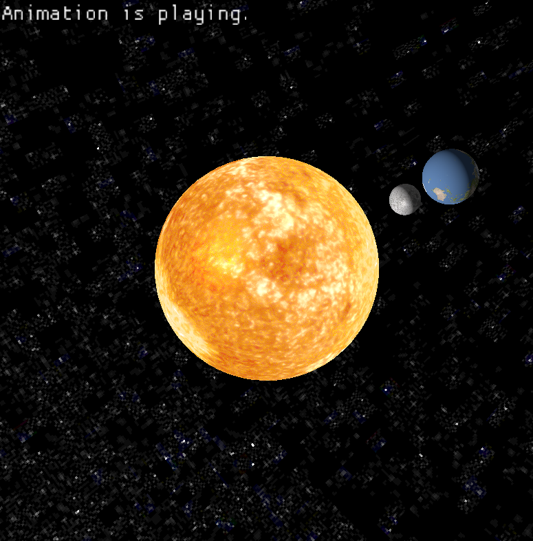

# Solar System

Virtual Orrery and Real Time Rendering. A virtual orrery that animates and renders the relative motions of the Sun, Earth and Moon against a starry backdrop by applying shading and lighting.

## Keyboard Controls
### Adjusting the Camera
Right click and drag to adjust the camera's view. The camera is always focused on the sun.
Use the scrollwheel to adjust the zoom.

### Adjusting the Animation Speed
#### `↑`: Increase Orbital/Rotation Speed of planets
#### `↓`: Decrease Orbital/Rotation Speed of planets
#### `SPACEBAR`: Pause the animation
#### `R`: Restart the animation
---
## Compiler and Platform
- Compiler: Microsoft C++ Compiler (MSVC 2022)
- Platform: Microsoft Windows 10 Pro (64-bit)
